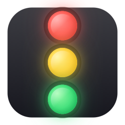

<div align="center">



# Lights

**A floating traffic light for your AI coding assistant.**
**给 AI 编程助手的浮动交通灯。**

[English](#english) · [中文](#中文)

### ⬇️ [Download Lights v0.1.0 for macOS](https://github.com/fengyiqicoder/Lights/releases/latest/download/Lights-v0.1.0.zip)

*macOS 14+ · Developer-ID signed · ~1.5 MB*

</div>

> **First launch / 第一次打开:** macOS Gatekeeper will block the signed-but-not-yet-notarized build. **Right-click the app → "Open" → "Open" again** (one-time, per macOS policy). After that it launches normally.
> macOS Gatekeeper 会拦一下还没 notarize 的版本。**右键 → 打开 → 再点一次"打开"**，之后就正常了。

---

## English

Lights is a tiny macOS menu-bar app that shows a floating traffic light reflecting what your AI coding assistant is doing right now:

| Light | Meaning |
|---|---|
| 🔴 Red | The assistant is executing — model is generating, tools running |
| 🟡 Yellow | The assistant needs your input — permission prompt, AskUserQuestion, ExitPlanMode |
| 🟢 Green | Idle / response complete |

It listens on `http://127.0.0.1:9876` and your AI tool fires `curl` from lifecycle hooks. Glanceable. No context switch.

### Supported tools

| Tool | Status | How |
|---|---|---|
| Claude Code | ✅ Full event hooks | `~/.claude/settings.json` |
| Codex CLI | ✅ Full event hooks | `~/.codex/hooks.json` + `features.hooks = true` in `config.toml` |
| Goose | ⏳ Placeholder — researching | — |
| OpenCode | ❌ No event hooks | — |

### Install

Requires macOS 14+ and Swift 5.9+ (Xcode Command Line Tools is enough).

```bash
git clone https://github.com/fengyiqicoder/Lights.git
cd Lights
./build-app.sh
open Lights.app
```

On first launch a Setup panel pops up. For each supported tool detected on your system, click **[Install]** — Lights writes the hooks directly to that tool's config (backing up first).

You can also use the [skills.sh](https://skills.sh) distribution if you prefer Claude itself walk you through:

```bash
npx skillsadd fengyiqicoder/lights-hooks
```

Then in Claude Code: *"set up lights hooks"*.

### Usage

| Action | How |
|---|---|
| Show / hide the floating window | Menu-bar icon → *Show / Hide Window* |
| Open Setup | Menu-bar icon → *Setup Hooks…* — or right-click the floating window |
| Change size | Right-click the floating window → *Size ▸* (Small / Medium / Large) |
| Manual override | Click any single light to lock it on, or use the HTTP endpoints below |
| Move the window | Drag the dark housing background |
| Quit | Menu-bar icon → *Quit Lights* |

### HTTP control

```bash
curl localhost:9876/executing   # → red
curl localhost:9876/permission  # → yellow
curl localhost:9876/idle        # → green
curl localhost:9876/off         # → all off
curl localhost:9876/status      # → query current state
```

### How it works

```
  Claude Code / Codex CLI
        │ (lifecycle event)
        ▼
  hook command:  curl http://127.0.0.1:9876/<state>
        │
        ▼
  Lights HTTP server  ──▶  SwiftUI state  ──▶  floating light updates
```

The Setup panel reads each tool's config, detects whether Lights hooks are present, and writes/removes them via an idempotent JSON merge engine that preserves all your other hooks. A timestamped backup is saved beside the config file before every write.

### Known limitations

- On MacBook Pro with notch + many menu-bar items already, the new status-item icon may be pushed behind the notch and become invisible. Right-clicking the floating window provides the same menu — functionality is not lost.
- Live status-color mirroring in the menu-bar icon is not yet implemented (it stays as a neutral 3-dot template).

### Project layout

```
Sources/Lights/
  main.swift                       app delegate, content view, lights window
  StatusServer.swift               HTTP listener on 9876
  MenuBarController.swift          NSStatusItem + menu
  ToolIntegration.swift            protocol + types
  JSONHookMerger.swift             shared idempotent JSON merge engine
  ClaudeCodeIntegration.swift      ~/.claude/settings.json driver
  CodexIntegration.swift           ~/.codex/ driver (hooks.json + config.toml)
  PlaceholderIntegrations.swift    Goose, OpenCode stubs
  SetupView.swift                  SwiftUI panel
  SetupManager.swift               observable state + first-launch flag
tools/render-icon.swift            Core Graphics icon generator
skill/SKILL.md                     skills.sh distributable skill
docs/superpowers/specs/            design notes
build-app.sh                       build → .app bundle
```

### Development

```bash
swift build                                     # CLI only
./build-app.sh                                  # .app bundle (re-renders icon)
swift tools/render-icon.swift                   # only regenerate PNGs
iconutil -c icns AppIcon.iconset -o Resources/AppIcon.icns
```

### License

MIT. See [LICENSE](LICENSE).

---

## 中文

Lights 是一个 macOS 菜单栏小工具：屏幕角落悬浮一盏交通灯，实时显示 AI 编程助手的状态。

| 灯色 | 含义 |
|---|---|
| 🔴 红 | AI 正在执行 —— 模型在生成、工具在运行 |
| 🟡 黄 | AI 等你回应 —— 权限弹窗、AskUserQuestion、ExitPlanMode |
| 🟢 绿 | 空闲 / 回复完成 |

工作机制：Lights 在 `http://127.0.0.1:9876` 监听，AI 工具的 lifecycle hook 用 `curl` 通知它。一眼看完，不需要切窗口。

### 支持的工具

| 工具 | 状态 | 配置位置 |
|---|---|---|
| Claude Code | ✅ 完整事件 hook | `~/.claude/settings.json` |
| Codex CLI | ✅ 完整事件 hook | `~/.codex/hooks.json` + `config.toml` 加 `features.hooks = true` |
| Goose | ⏳ 占位中 —— 文档调研中 | — |
| OpenCode | ❌ 没有事件 hook | — |

### 安装

需要 macOS 14+ 和 Swift 5.9+（装了 Xcode Command Line Tools 就够）。

```bash
git clone https://github.com/fengyiqicoder/Lights.git
cd Lights
./build-app.sh
open Lights.app
```

第一次启动会自动弹 Setup 面板，列出系统上检测到的所有工具。点对应工具的 **[Install]** —— Lights 会直接改对应配置文件（写之前自动备份）。

不想用 GUI 的人可以走 [skills.sh](https://skills.sh) 渠道：

```bash
npx skillsadd fengyiqicoder/lights-hooks
```

然后在 Claude Code 里说"装一下 lights hooks"。

### 用法

| 操作 | 怎么做 |
|---|---|
| 显示 / 隐藏浮窗 | 菜单栏图标 → *Show / Hide Window* |
| 打开 Setup | 菜单栏图标 → *Setup Hooks…*，或右键浮动灯窗口 |
| 切换尺寸 | 右键浮窗 → *Size ▸*（Small / Medium / Large） |
| 手动控制 | 点任意一盏灯锁定颜色，或用下面的 HTTP 接口 |
| 移动位置 | 拖住灯窗口深色背景 |
| 退出 | 菜单栏图标 → *Quit Lights* |

### HTTP 控制

```bash
curl localhost:9876/executing   # → 红
curl localhost:9876/permission  # → 黄
curl localhost:9876/idle        # → 绿
curl localhost:9876/off         # → 全灭
curl localhost:9876/status      # → 查询当前状态
```

### 工作原理

```
  Claude Code / Codex CLI
        │ (lifecycle 事件)
        ▼
  hook 命令:  curl http://127.0.0.1:9876/<state>
        │
        ▼
  Lights HTTP server  ──▶  SwiftUI 状态  ──▶  浮窗变色
```

Setup 面板会读每个工具的配置，判断 Lights 的 hook 是否已经装好，通过一个幂等的 JSON merge 引擎写入或移除 —— 保留你已有的其它所有 hook。每次写入前会在配置文件旁边留一份带时间戳的备份。

### 已知限制

- 带刘海的 MacBook Pro + 菜单栏已经塞了很多图标时，新加的 status item 可能被挤到刘海后面看不见。右键浮窗有等价的菜单 —— 功能不丢，只是图标隐藏。
- 菜单栏图标目前是中性的三点 template，还没做实时状态色镜像。

### 项目结构

```
Sources/Lights/
  main.swift                       AppDelegate / ContentView / 浮动窗口
  StatusServer.swift               9876 端口 HTTP 监听
  MenuBarController.swift          NSStatusItem + 菜单
  ToolIntegration.swift            协议 + 类型
  JSONHookMerger.swift             共享的幂等 JSON merge 引擎
  ClaudeCodeIntegration.swift      操作 ~/.claude/settings.json
  CodexIntegration.swift           操作 ~/.codex/（hooks.json + config.toml）
  PlaceholderIntegrations.swift    Goose、OpenCode 占位
  SetupView.swift                  SwiftUI 设置面板
  SetupManager.swift               可观察状态 + 首次启动标记
tools/render-icon.swift            Core Graphics 图标生成
skill/SKILL.md                     给 skills.sh 用的 skill 包
docs/superpowers/specs/            设计文档
build-app.sh                       构建 .app
```

### 开发

```bash
swift build                                     # 只编译命令行二进制
./build-app.sh                                  # 打包 .app（顺便重新渲染图标）
swift tools/render-icon.swift                   # 单独重新生成图标 PNG
iconutil -c icns AppIcon.iconset -o Resources/AppIcon.icns
```

### 许可

MIT，见 [LICENSE](LICENSE)。

---

<div align="center">

🤖 Built with [Claude Code](https://claude.com/claude-code)

</div>
